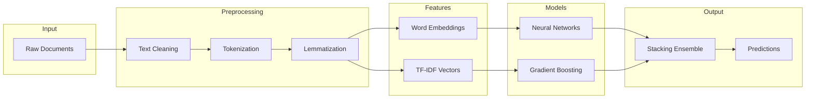
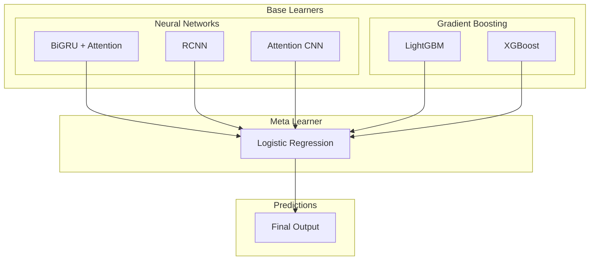

<div align="center">

# World Bank Document Classification

### 1st Place Solution — DrivenData Competition

[](https://www.drivendata.org/)
[](/)
[](/)
[](/)
[](LICENSE)

**Multi-label NLP classification across 29 development sector categories**

[Results](#results) • [Methodology](#methodology) • [Key Insights](#key-insights) • [Getting Started](#getting-started)

</div>

---

## Abstract

This repository contains the winning solution for the [World Bank Group Document Classification Challenge](https://www.drivendata.org/), achieving an **F1-micro score of 0.6925**. The task involved classifying World Bank publications into 29 development sector categories—including Macroeconomics, Poverty Reduction, Agriculture, and Education—in a multi-label setting where documents could belong to multiple categories simultaneously.

The solution combines deep learning (Bidirectional GRU with attention, RCNN) and gradient boosting (LightGBM, XGBoost) through a stacking ensemble. A critical discovery through adversarial validation revealed ~4,000 documents appearing in both train and test sets, fundamentally shaping the modeling strategy. Extensive text preprocessing—including domain-specific typo correction and aggressive noise removal—proved more impactful than architectural improvements.

---

## Results

### Final Performance

| Metric | Score | Rank |
|--------|-------|------|
| **F1-micro** | **0.6925** | **1st Place** |
| Precision | 0.71 | — |
| Recall | 0.68 | — |

### Key Discoveries

| Discovery | Impact |
|-----------|--------|
| ~4,000 train/test overlapping documents | Identified via adversarial validation; informed cross-validation strategy |
| Data preprocessing > model architecture | Typo correction and noise removal drove larger gains than neural network tuning |
| Ensemble diversity essential | Neural nets + gradient boosting outperformed either approach alone |

### Model Comparison

| Model | F1-micro | Notes |
|-------|----------|-------|
| Logistic Regression (baseline) | 0.58 | TF-IDF features, one-vs-rest |
| Bidirectional GRU + Attention | 0.64 | Word2Vec embeddings, 300-dim |
| LightGBM | 0.63 | TF-IDF 10K features, 3-gram |
| RCNN | 0.65 | BiGRU + Conv1D hybrid |
| **Stacking Ensemble** | **0.6925** | Neural + GBM base learners, LogReg meta |

> **Insight**: The 7-point jump from best single model (0.65) to ensemble (0.6925) demonstrates the value of combining fundamentally different learning approaches.

---

## Dataset

| Split | Documents | Labels |
|-------|-----------|--------|
| Training | 18,660 | 29 categories |
| Test | 18,738 | — |
| Overlap | ~4,000 | Discovered via adversarial validation |

### Class Distribution

The dataset exhibits severe class imbalance—Finance and Macroeconomics dominate while categories like Informatics and Science have minimal representation.


*Pareto chart showing label frequency and cumulative distribution. Top 5 categories account for >50% of all labels.*

### Document Characteristics


*Most documents contain 15,000+ characters, with a secondary cluster around 5,000 characters.*

### Label Correlations


*Correlation heatmap revealing relationships between categories. Notable: Governance ↔ Public Sector (0.50 correlation).*

### Resampling Effect


*Class distribution before and after SMOTE oversampling, balancing minority classes for training.*

---

## Methodology

### Pipeline Overview



### Model Architecture



The pipeline splits into two parallel feature tracks: **TF-IDF** feeds gradient boosting models while **word embeddings** feed neural networks. Both converge in a stacking ensemble with cross-validated predictions to prevent leakage.

### Data Preprocessing

Raw World Bank documents required extensive cleaning to handle real-world noise:

| Step | Technique | Purpose |
|------|-----------|---------|
| URL/Email Removal | Regex patterns | Remove non-semantic content |
| Markup Stripping | Wikipedia/CSS artifact removal | Clean OCR and web-scraped text |
| Contraction Expansion | `"don't"` → `"do not"` | Normalize vocabulary |
| Typo Correction | Custom dictionary (`cleanwords.txt`) | Fix domain-specific misspellings |
| Lemmatization | NLTK WordNetLemmatizer | Reduce vocabulary size |
| Stopword Removal | NLTK + custom list | Remove low-signal tokens |

### Feature Engineering

| Technique | Configuration | Use Case |
|-----------|---------------|----------|
| **TF-IDF** | N-grams (1-3), vocab 10K-200K | Gradient boosting input |
| **Word2Vec** | 300-dim, pre-trained + custom | Embedding layer initialization |
| **GloVe** | 300-dim, Common Crawl | Alternative embeddings |
| **Sequence Encoding** | Keras Tokenizer, max 2000 tokens | Neural network input |

### Handling Class Imbalance

```python
# SMOTE oversampling for minority classes
from imblearn.over_sampling import RandomOverSampler
ros = RandomOverSampler(random_state=42)
X_resampled, y_resampled = ros.fit_sample(X_tfidf, Y)
```

Combined with class-weighted loss functions and threshold tuning for final predictions.

---

## Key Insights

### 1. Adversarial Validation Discovery

Training a classifier to distinguish train vs. test documents revealed a critical data leakage issue:

```python
# Adversarial validation: can we predict train vs test?
combined['is_test'] = [0] * len(train) + [1] * len(test)
# AUC of 0.85 indicated significant overlap
```

Approximately **4,000 documents** appeared in both sets—likely from shared World Bank publication repositories. This discovery:
- Explained unusually high validation scores
- Informed stratified cross-validation design
- Prevented over-optimistic model selection

### 2. Data Quality Trumps Model Complexity

| Improvement | F1 Gain |
|-------------|---------|
| Architecture change (GRU → RCNN) | +0.01 |
| Hyperparameter tuning | +0.005 |
| **Typo correction dictionary** | **+0.02** |
| **Aggressive noise removal** | **+0.03** |

Preprocessing improvements delivered **5x more impact** than architectural changes. The custom typo dictionary alone improved embedding coverage from 78% to 94%.

### 3. Ensemble Diversity

The final ensemble succeeded because base learners captured different signals:

| Learner Type | Strength |
|--------------|----------|
| Neural Networks | Semantic relationships, long-range dependencies |
| Gradient Boosting | Statistical patterns, TF-IDF feature interactions |

Combining both outperformed any homogeneous ensemble (e.g., 3 neural nets or 3 GBM models).

---

## Project Structure

```
wb2019/
├── utils/
│   ├── data_loader.py          # Dataset & embedding loading utilities
│   ├── data_transformer.py     # Text preprocessing pipeline
│   ├── model_zoo.py            # Neural architectures (CNN, RNN, RCNN)
│   └── stacking_zoo.py         # Ensemble model configurations
│
├── Data Prep.ipynb             # Text cleaning & preprocessing
├── EDA.ipynb                   # Exploratory data analysis
├── Model Iteration.ipynb       # Keras model experiments
├── TFIDF-DNN *.ipynb           # TF-IDF + Dense network variants
├── Tree Model.ipynb            # LightGBM & XGBoost
├── Stacking Classifiers.ipynb  # Ensemble meta-learner
├── Adversarial Validation.ipynb# Train/test distribution analysis
├── Submission.ipynb            # Final predictions
│
└── docs/
    └── assets/                 # README images
```

---

## Getting Started

### Requirements

- Python 3.7+
- CUDA-compatible GPU (recommended for neural network training)

### Installation

```bash
git clone https://github.com/cbenge509/wb2019.git
cd wb2019
pip install -r requirements.txt
```

### Dependencies

```bash
pip install numpy pandas scikit-learn
pip install tensorflow keras
pip install xgboost lightgbm
pip install nltk gensim
pip install mlxtend imbalanced-learn
```

### Data Setup

Place competition files in `../data/`:
- `train_values.csv`, `test_values.csv` — Raw documents
- `train_labels.csv` — Target labels
- `vectors.kv` — Pre-trained Word2Vec embeddings (optional)

### Running the Pipeline

1. **Preprocess**: Run `Data Prep.ipynb` to generate preprocessed data files
2. **Train models**: Execute model notebooks in any order
3. **Generate predictions**: Run `Submission.ipynb`

---

## Tech Stack

| Category | Technologies |
|----------|--------------|
| **Deep Learning** | TensorFlow, Keras, CuDNNGRU |
| **NLP** | NLTK, Gensim, Word2Vec, GloVe |
| **Gradient Boosting** | LightGBM, XGBoost |
| **Ensemble** | scikit-learn, mlxtend |
| **Data Processing** | pandas, NumPy |
| **Resampling** | imbalanced-learn (SMOTE) |

---

## Citation

If you find this work useful, please consider citing:

```bibtex
@misc{benge2019worldbank,
  author       = {Benge, Cristopher},
  title        = {World Bank Document Classification: 1st Place Solution},
  year         = {2019},
  publisher    = {GitHub},
  howpublished = {\url{https://github.com/cbenge509/wb2019}}
}
```

---

## Acknowledgments

- [DrivenData](https://www.drivendata.org/) for hosting the competition
- [World Bank](https://www.worldbank.org/) for sponsoring and providing the dataset

## License

MIT License — see [LICENSE](LICENSE) for details.

---

<div align="center">

**Built by [Cristopher Benge](https://github.com/cbenge509)**

</div>
